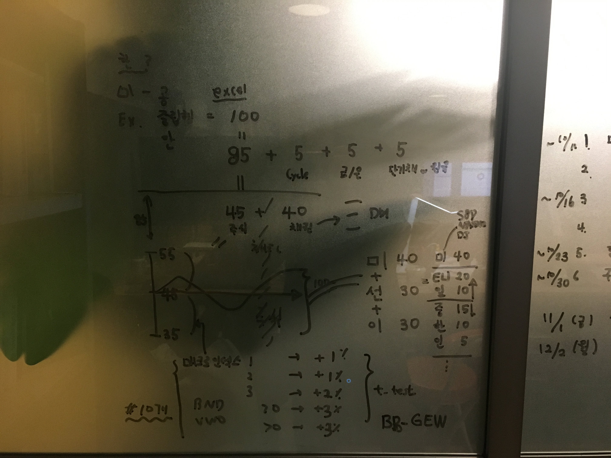

일정 계획
(~ 10/11) 
1. 메일로 베타() 구성방법 / 내용 확정 excel(오)
 * 어떤 종류의 상품을 출시 후보로 염두하는지 (미국/한국, 공격/중립/안정형)
 * 풀베타를 어떤 ETF들로, 어떤 비중을 default로 구성하는지
 * 어떤 메크로 인덱스를 어떤 임계점을 기준으로 risk on/off 얼마나 할지
 * 위에서 구성한 주식시장 관련 풀베타와 채권.금.은.원유,단기채 등등 SAA 비중에 대한 의견.
 * 관련된 지표, 인덱스 등등의 데이터 획득 및 가공 방법

2. 공부 + 알파 어떻게 녹일지 (구)
베타의 원리에 대한 이해가 필요하다.

(~ 10/16)
1. 내용이 합의(구,오) 되면 검증 한다.
    -  이 방법을 검증하고, 유니버스 / 파라미터 test, 확정. (구,신))
    로보어드바이저 아키텍처 구현.
    
(~ 10/23)

(~ 10/30)
1. 구현한다 (구,신)

(~11/1(금))
1. 상품출시 목적.

(12/2(월))
1. 1차 목표 지연시.

상품을 어떻게 설계할까?

1. 유니버스 - 미국 상장 글로벌 ETF
2. 공격/중립/안정 - SAA 비율은 그때 드린 부분 참고
3. 알파 모델 영향력 - 20%
(즉 70% 주식에서 + 14%까지 확장 = total 70%~ 84%,  이걸 63~77%로 할지 고민 필요.)

큰틀은 이 정도.

